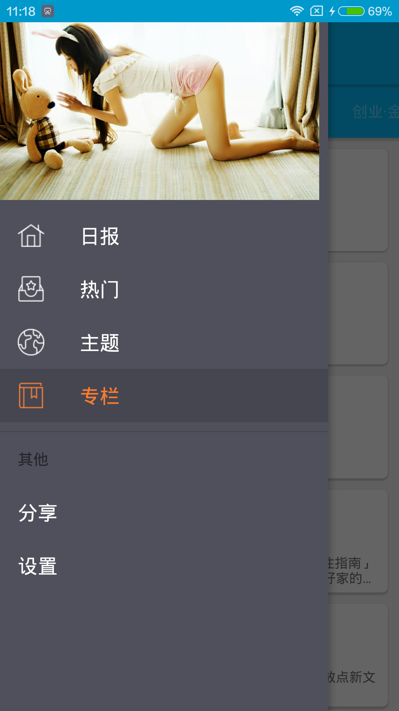

# ZhiHuDemo
##**基于MVP + RxJava + Retrofit + Glide + Material Design**
##**简介**

本应用是我业余时间的一个练手项目，也是我熟悉开发完整App流程的过程的一个项目。作为一个Android新手，我知道这个项目其实蛮烂的，
甚至有些地方在开发时知道有更好的实现方案，但是限于当时的水平很多都没来得及改善，不过，这个项目后面我会持续更新，我也坚信
它会越来越好。

参考知乎日报，接口数据来源[知乎日报API分析](https://github.com/izzyleung/ZhihuDailyPurify/wiki/%E7%9F%A5%E4%B9%8E%E6%97%A5%E6%8A%A5-API-%E5%88%86%E6%9E%90)，
参考知乎专栏，接口数据来源[知乎专栏API分析](https://marktony.github.io/2016/05/14/%E7%9F%A5%E4%B9%8E%E4%B8%93%E6%A0%8FAPI%E5%88%86%E6%9E%90/),为非官方开源所得，API的所有权归©知乎所有。

##**截图**

##**相关技术**
- 客户端使用MVP架构
- 网络层使用RxJava + Retrofit2
- json解析使用Gson
- 图片加载使用了Glide
- 注解使用butterknife
- Android5.0技术：Toolbar, RecyclerView, CardView, SwipeRefreshLayout
- 自定义CircleImageView组件

##**第三方库**
- [RxJava](https://github.com/ReactiveX/RxJava)
- [Retrofit](https://github.com/square/retrofit)
- [Glide](https://github.com/bumptech/glide)
- [Butter Knife](https://github.com/JakeWharton/butterknife)
- [Convenientbanner](https://github.com/saiwu-bigkoo/Android-ConvenientBanner)

