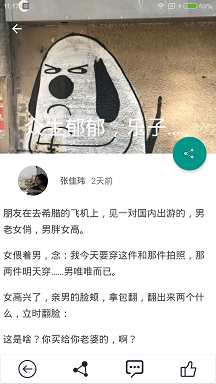

# ZhiHuDemo
##**简介**
自从年初转行自学Android时间也不短了，苦于一直没什么真正的项目开发经验，找工作拿不出干货也毫无优势可言，便有了这个项目。

这个项目是我的一个练手项目，也是我熟悉开发完整App流程的过程的一个项目。作为一个Android新手，我知道这个项目其实蛮烂的，
甚至有些地方在开发时知道有更好的实现方案，但是限于当时的水平很多都没来得及改善，不过，这个项目后面我会持续更新，我也坚信
它会越来越好。但此刻，我首要目标肯定是先找到工作，毕竟现在移动开发的形势不那么乐观了（微信小程序都开始内测了...)

参考知乎日报，接口数据来源[知乎日报API分析](https://github.com/izzyleung/ZhihuDailyPurify/wiki/%E7%9F%A5%E4%B9%8E%E6%97%A5%E6%8A%A5-API-%E5%88%86%E6%9E%90)，
参考知乎专栏，接口数据来源[知乎专栏API分析](https://marktony.github.io/2016/05/14/%E7%9F%A5%E4%B9%8E%E4%B8%93%E6%A0%8FAPI%E5%88%86%E6%9E%90/),为非官方开源所得，API的所有权归©知乎所有。

##**截图**

